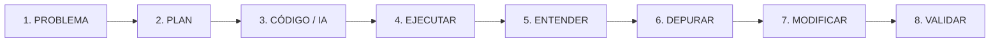

# 01 · GUÍA GENERAL DEL CURSO: PYTHON EN 2027

## 1. Visión Global del Itinerario

El curso **"Programar con Python en 2027: De los Fundamentos a la Programación Asistida por IA"** es un programa formativo modular desarrollado para la **Red de Centros Circular FAB**. 

Su propósito es capacitar a ciudadanos, emprendedores, técnicos y profesionales en el uso de Python como herramienta de computación moderna, automatización, análisis de datos y desarrollo de software asistido por Inteligencia Artificial generativa.

### Objetivos Generales
1. **Desmitificar la programación:** Transformar la barrera técnica inicial en una habilidad práctica accesible mediante entornos interactivos inmediatos (Google Colab / Jupyter Notebooks).
2. **Dominar las estructuras esenciales del lenguaje:** Comprender la lógica algorítmica, las colecciones de datos, el paradigma funcional/modular y los fundamentos de la Programación Orientada a Objetos (POO).
3. **Manejar datos y automatización:** Integrar librerías estándar del ecosistema Python (NumPy, Pandas, Playwright, ReportLab) para resolver casos de negocio reales.
4. **Dar el salto al entorno profesional:** Migrar con soltura del cuaderno interactivo a proyectos locales estructurados en Visual Studio Code, con entornos virtuales (`venv`), gestión de paquetes (`pip`) y control de versiones básico (`Git`).
5. **Gobernar el desarrollo asistido por IA (2027):** Integrar asistentes y modelos de lenguaje como copilotos de programación bajo un protocolo estricto de auditoría y validación crítica, erradicando el "desarrollo zombi".

---

## 2. Metodología Pedagógica: "Aprender Haciendo"

El curso destierra las clases magistrales extensas y adopta un enfoque de **aprendizaje activo basado en retos iterativos**:

```
[Explicación breve (3-5 min)] ➔ [Ejemplo mínimo ejecutable] ➔ [Ejecución en vivo] ➔ [Modificación guiada] ➔ [Predicción de salida] ➔ [Mini-Reto individual] ➔ [Comprobación]
```

### El Flujo Crítico de Trabajo 2027 (Asistido por IA)
En la era actual, programar no consiste en memorizar sintaxis, sino en orquestar soluciones y validar código:



1. **Problema:** Definir claramente qué se quiere resolver en lenguaje natural y reglas de negocio.
2. **Plan:** Diseñar la arquitectura lógica (entradas, pasos de procesamiento, estructuras de datos y salidas).
3. **Código / IA:** Redactar el código manualmente o solicitarlo a la IA mediante un prompt estructurado y acotado.
4. **Ejecutar:** Correr el script en el entorno real (consola / Colab / VS Code).
5. **Entender:** Analizar qué hace cada línea antes de aceptarla.
6. **Depurar:** Leer el *Traceback*, localizar excepciones o errores de lógica.
7. **Modificar:** Ajustar el código para satisfacer requerimientos específicos o casos de borde.
8. **Validar:** Ejecutar baterías de pruebas con datos extremos y verificar la ausencia de efectos secundarios.

### Metodología "Anti-Zombi"
Se denomina **programador zombi** a quien copia y pega fragmentos de código autogenerados por IA sin comprender su funcionamiento, sin saber depurarlos cuando fallan y sin poder justificar sus decisiones de diseño. El curso implementa una evaluación continua basada en **defensa oral, predicción de salidas y lectura crítica de trazas de error**.

---

## 3. Mapa Curricular del Curso (B1 a B7)

```
[B1: Fundamentos y Lógica]
        │
        ▼
[B2: Estructuras de Datos] ──► [Proyecto B2: Clasificador e Indexador de Palabras]
        │
        ▼
[B3: Funciones y Modularidad] ──► [Proyecto B3: SAMI-Lite (Persistencia JSON/CSV)]
        │
        ▼
[B4: Programación Orientada a Objetos] ──► [Proyecto B4: SAMI-OOP (Clases y Herencia)]
        │
        ▼
[B5: Python Aplicado y Librerías] ──► [Proyecto B5: SAMI-Applied (Scraping, NumPy, Pandas, PDF)]
        │
        ▼
[B6: Del Notebook al Entorno Profesional] ──► [Proyecto B6: SAMI-Local (VS Code, venv, Git, Debugger)]
        │
        ▼
[B7: Python + IA] ──► [Proyecto Final: SAMI-Final Asistido + Defensa Técnica]
        │
        └─► [Ampliación Opcional: Grafos LangGraph con Estado e Intervención Humana]
```

---

## 4. Tabla Sinóptica de los 7 Bloques

| Bloque | Título y Enfoque | Entorno | Conceptos Centrales | Proyecto / Hito |
| :--- | :--- | :--- | :--- | :--- |
| **B1** | **Fundamentos y Lógica**<br>Primeros programas en notebook | Google Colab / Notebook | `print()`, variables, tipos (`str`, `int`, `float`, `bool`), `divmod()`, casting, `input()`, f-strings, `if/elif/else`, bucles `for`/`while`, `range()`, `break`, `continue`. | Prácticas 01 a 04: operaciones, tramos de precios, cálculo de medias y bucles interactivos. |
| **B2** | **Estructuras de Datos**<br>Colecciones y manipulación | Google Colab / Notebook | Cadenas (slicing bidireccional y reversión), listas y mutabilidad, tuplas (inmutabilidad), sets (unicidad y teoría de conjuntos), diccionarios (claves y `.get()`), comprehensions. | **Clasificador e Indexador de Palabras Clave** (análisis de texto y conteo estructurado). |
| **B3** | **Funciones y Modularidad**<br>Programas reutilizables | Colab / Scripts `.py` | `def`, `return` frente a `print()`, parámetros opcionales por defecto, scope local vs global, docstrings, `try-except-else-finally`, `with open()`, JSON nativo, CSV, `import`. | **SAMI-Lite**: Gestor modular de datos de consola con persistencia física en JSON/CSV. |
| **B4** | **POO (Orientada a Objetos)**<br>Modelado robusto | Colab / VS Code | Clases vs instancias, `__init__`, `self`, métodos de instancia, atributos públicos y privados (convención `_`), composición ("tiene un"), herencia ("es un"), `super()`, polimorfismo. | **SAMI-OOP**: Refactorización completa del sistema a arquitectura de clases jerárquicas y polimórficas. |
| **B5** | **Python Aplicado y Librerías**<br>Ecosistema de datos | Colab / VS Code | NumPy (arrays `ndarray`, operaciones vectorizadas, estadísticas), Pandas (Series, DataFrames, filtros booleanos, dataset GoT `got_1.csv`), Playwright (automatización web), ReportLab (generación de informes PDF). | **SAMI-Applied**: Pipeline completo: extracción web ➔ cálculo vectorial ➔ análisis tabular ➔ informe PDF. |
| **B6** | **Del Notebook al Entorno Profesional**<br>Desarrollo local | VS Code Local | De `.ipynb` a scripts `.py`, terminal integrada, entornos virtuales (`python -m venv`), gestión con `pip` y `requirements.txt`, control de versiones (`Git/GitHub`), debugger interactivo de VS Code. | **SAMI-Local**: Estructura de paquete profesional en disco local con repositorio Git, virtualenv y depuración con breakpoints. |
| **B7** | **Python + IA**<br>Desarrollo asistido y validación | VS Code + LLMs | Flujo de desarrollo asistido 2027, prompts estructurados para código, auditoría crítica de IA, depuración asistida, refactorización segura, plan de validación. *(Ampliación: LangGraph)*. | **SAMI Final**: Entrega del sistema completo auditado con `registro-ia.md`, `plan-validacion.md` y `README-defensa.md`. |

---

## 5. El Eje Vertebrador: La Progresión SAMI

Para evitar que los alumnos perciban los bloques como islas inconexas, el curso utiliza un hilo conductor práctico llamado **SAMI** (*Sistema de Auditoría y Monitorización Inteligente* / *Sistema de Automatización Modular Integrado*):

1. **B3 (SAMI-Lite):** El alumno crea un sistema de registro modular basado en funciones y archivos planos JSON/CSV.
2. **B4 (SAMI-OOP):** Rediseña el sistema modelando entidades (`Sensor`, `Dispositivo`, `Alerta`, `Auditoria`) mediante clases y herencia.
3. **B5 (SAMI-Applied):** Conecta SAMI a fuentes de datos web mediante Playwright, analiza métricas con NumPy/Pandas y exporta resúmenes ejecutivos en PDF con ReportLab.
4. **B6 (SAMI-Local):** Monta SAMI como una aplicación de software profesional en su equipo local con VS Code, `venv`, Git y depuración paso a paso.
5. **B7 (SAMI Final):** Optimiza, amplía y defiende técnicamente el proyecto final utilizando IA como copiloto, documentando exhaustivamente las decisiones tomadas.

---

## 6. Lab Final Opcional: Python en Acción

Tras B7 existe un recurso independiente llamado **Python en Acción: 5 cosas más que puedes hacer**.

Este Lab no es B8, no forma parte de la evaluación obligatoria y no altera la progresión SAMI. Su papel es cerrar el itinerario con experiencias cortas y tangibles que muestran aplicaciones reales de Python:

1. **OpenCV:** webcam interactiva con modos `1` normal, `2` gris, `3` GaussianBlur, `4` Canny, `S` captura y `Q` salida.
2. **Pillow:** abrir una imagen neutra, transformarla y guardar una nueva imagen.
3. **Automatización segura:** organizar únicamente archivos falsos dentro de `lab_archivos_prueba/`.
4. **openpyxl:** crear `ventas_lab.xlsx` con datos, fórmulas y formato básico.
5. **Tkinter:** construir una pequeña aplicación gráfica con entrada, botón y resultado.

El flujo pedagógico del Lab es siempre: VER -> PROBAR -> MODIFICAR -> MINI-RETO.

---

## 7. Contexto de Aplicación en la Red Circular FAB

Los talleres de la Red Circular FAB se caracterizan por una gran diversidad de perfiles de alumnado (desde personas sin experiencia previa hasta perfiles técnicos que buscan actualizarse). 

Por ello, el formador debe:
* **Fomentar la autonomía:** Que los alumnos lean los errores de consola antes de pedir ayuda inmediata.
* **Contextualizar los ejercicios:** Relacionar los problemas con la gestión de talleres, control de inventarios, sensores de fabricación digital, monitorización de recursos y análisis de datos locales.
* **Ajustar el ritmo con flexibilidad:** Utilizar las adaptaciones temporales (150 min estándar, 90 min intensivo, 60 min compacto o 30 min cápsula) según la convocatoria.
