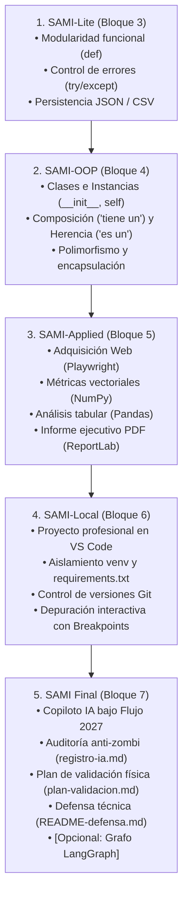

# 06 · LA PROGRESIÓN DEL PROYECTO INTEGRADOR: SAMI

## 1. ¿Qué es SAMI?

**SAMI** (*Sistema de Auditoría y Monitorización Inteligente* o *Sistema de Automatización Modular Integrado*) es el **eje vertebrador de aprendizaje práctico** a lo largo del curso **"Programar con Python en 2027"**.

En lugar de realizar ejercicios aislados y desconectados, el alumno construye y refactoriza incrementalmente una aplicación completa de monitorización y gestión técnica contextualizada en un entorno de fabricación digital y prototipado (como los centros de la **Red Circular FAB**).

---

## 2. Mapa Evolutivo de SAMI a lo Largo del Curso



---

## 3. Desglose Fase a Fase de la Arquitectura SAMI

### Fase 1: SAMI-Lite (Bloque 3 · Funciones y Modularidad)
* **Objetivo:** Pasar del script secuencial de una sola celda a un sistema de consola estructurado en funciones de responsabilidad única.
* **Estructura de Código:**
  ```
  sami_lite/
  ├── main.py              # Bucle de menú interactivo de consola
  ├── gestor_datos.py      # Funciones: guardar_evento(), cargar_historial()
  ├── datos/
  │   ├── eventos.json     # Registro estructurado de eventos
  │   └── auditoria.csv    # Registro plano tabular de lecturas
  ```
* **Conceptos Evaluados:**
  * Uso de `return` para comunicar funciones.
  * Parámetros por defecto para niveles de alerta (`nivel="INFO"`).
  * Manejo de excepciones `try-except` capturando `FileNotFoundError` y `json.JSONDecodeError`.
  * Apertura segura de archivos con `with open(..., encoding="utf-8")`.

---

### Fase 2: SAMI-OOP (Bloque 4 · Programación Orientada a Objetos)
* **Objetivo:** Superar las limitaciones de los diccionarios dispersos acoplando datos (estado) y operaciones (comportamiento) en una jerarquía de clases sólida.
* **Estructura de Clases:**
  * `Dispositivo` *(Clase base abstracta/conceptual)*: `id_dispositivo`, `nombre`, `ubicacion`, método `obtener_estado()`.
  * `Sensor` *(Hereda de Dispositivo)*: `tipo_sensor`, `unidad`, `_lecturas`, métodos `registrar_lectura(valor)`, `promedio()`, `super().__init__()`.
  * `Actuador` *(Hereda de Dispositivo)*: `estado_encendido`, métodos `activar()`, `desactivar()`.
  * `FabLabManager` *(Composición)*: Posee una lista de `Dispositivo` y ejecuta operaciones polimórficas.
* **Conceptos Evaluados:**
  * Auto-referencia con `self` y constructores `__init__`.
  * Encapsulación de variables con convención `_`.
  * Invocación de la superclase con `super().__init__()`.
  * Polimorfismo: iterar sobre una lista heterogénea llamando a `.obtener_estado()` sin importar si es Sensor o Actuador.

---

### Fase 3: SAMI-Applied (Bloque 5 · Python Aplicado y Librerías)
* **Objetivo:** Conectar el sistema con datos externos reales y herramientas de análisis científico y generación de documentos.
* **Pipeline de Datos Integrado:**
  1. **Scraping / Adquisición (Playwright):** Automatiza la consulta de precios o disponibilidad de materiales de fabricación digital en un portal web.
  2. **Tratamiento Numérico (NumPy):** Convierte las series de mediciones en arrays `ndarray` para calcular estadísticas vectorizadas (medias, desviaciones, picos de consumo eléctrico en el taller).
  3. **Análisis Tabular (Pandas):** Estructura los registros en un `DataFrame`, realiza filtros condicionales por rango de fechas o umbrales de alerta y ordena por criticidad.
  4. **Informe Ejecutivo (ReportLab):** Genera automáticamente un documento formal `informe_auditoria_sami.pdf` con título, tabla formateada y conclusiones.
     En la versión actual de B5, este informe se genera realmente con ReportLab Platypus mediante `SimpleDocTemplate`, `Paragraph`, `Table`, `TableStyle`, `Spacer`, estilos básicos, `colors`, `A4` y `build()`.

---

### Fase 4: SAMI-Local (Bloque 6 · Del Notebook al Entorno Profesional)
* **Objetivo:** Convertir el prototipo en un paquete de software reproducible y mantenible en Visual Studio Code.
* **Estructura de Directorios del Proyecto Local:**
  ```
  sami_proyecto/
  ├── venv/                       # Entorno virtual aislado (en .gitignore)
  ├── src/
  │   ├── __init__.py
  │   ├── modelos/                # Clases OOP (Sensor, Actuador)
  │   ├── servicios/              # Módulos de scraping, análisis y PDF
  │   └── utilidades/             # Formateadores y validadores
  ├── tests/                      # Scripts de prueba con aserciones
  ├── data/                       # Archivos JSON y CSV de prueba
  ├── .gitignore                  # Exclusión de venv, __pycache__, logs
  ├── requirements.txt            # Dependencias congeladas con pip freeze
  ├── main.py                     # Punto de entrada con if __name__ == '__main__':
  └── README.md                   # Documentación técnica de instalación y uso
  ```
* **Conceptos Evaluados:**
  * Creación y activación de `venv`.
  * Gestión de dependencias limpias con `pip install -r requirements.txt`.
  * Historial de commits en Git con mensajes descriptivos.
  * Depuración con breakpoints en VS Code para trazar el flujo de ejecución.

---

### Fase 5: SAMI Final (Bloque 7 · Python + IA y Validación Crítica)
* **Objetivo:** Culminar la aplicación utilizando asistentes de IA bajo el flujo riguroso de 2027, garantizando la autoría y comprensión absoluta del código por parte del alumno.
* **Entregables Obligatorios de la Defensa:**
  1. **Código Fuente Completo:** Ejecutable en local sin errores de sintaxis ni cuelgues.
  2. **`registro-ia.md` (Diario de Asistencia IA):** Documento donde el alumno registra cada prompt enviado, el código retornado por el modelo, los errores o alucinaciones detectados y la modificación manual aplicada.
  3. **`plan-validacion.md`:** Tabla con al menos 5 casos de prueba ejecutados (casos normales, casos límite, entradas erróneas y validación de salidas).
  4. **`README-defensa.md`:** Memoria técnica donde el alumno justifica por qué eligió sus estructuras de datos, cómo organizó las clases y cómo resolvió los cuellos de botella.

---

## 4. Ampliación Opcional: SAMI-Agent con LangGraph

* **Carácter:** Estrictamente complementario / optativo.
* **Arquitectura del Agente:**
  * Definición de un grafo de estados (`StateGraph`).
  * **Nodos:** `NodoAuditoria` (analiza anomalías en sensores) ➔ `NodoDecisor` (evalúa si una alerta requiere parada de emergencia) ➔ `NodoInforme` (redacta el resumen).
  * **Intervención Humana (*Human-in-the-loop*):** El grafo se pausa en un punto de control (*checkpoint*) y solicita confirmación interactiva al formador/operador antes de ejecutar una acción crítica.

## Nota de Alcance: Python en Acción

El Lab final opcional **Python en Acción** no pertenece a la progresión SAMI. No debe intercalarse como fase nueva entre SAMI-Applied, SAMI-Local y SAMI Final. Si el profesor lo utiliza, debe presentarlo como exploración final independiente.

---

## 5. Rúbrica de Defensa Técnica de SAMI para el Formador

Al evaluar la entrega final de SAMI, el formador de Circular FAB debe formular 3 preguntas clave al alumno para verificar que no es un "programador zombi":

1. *"Señala una función o método de tu código y explícame qué contiene la memoria en la línea X justo antes del `return`."*
2. *"Si cambio este tipo de dato o desconecto este archivo JSON, ¿en qué línea saltaría la excepción y cómo la captura tu código?"*
3. *"Enséñame tu `registro-ia.md`: ¿qué error cometió la IA cuando le pediste esta parte y cómo lo arreglaste tú a mano?"*
